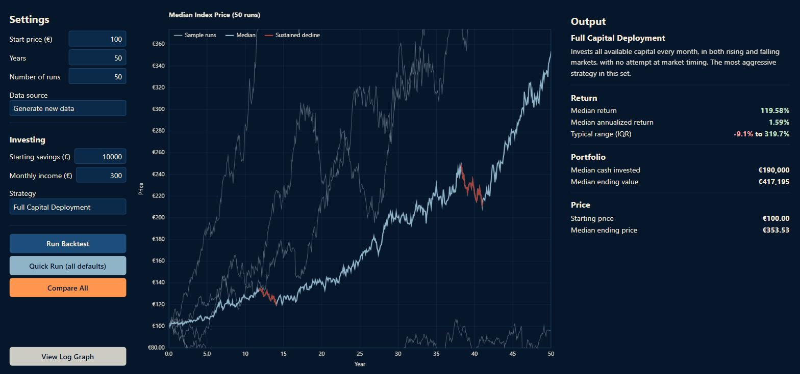
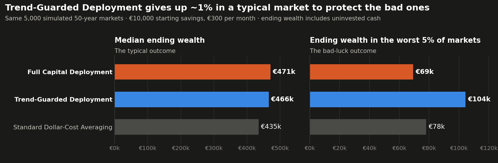
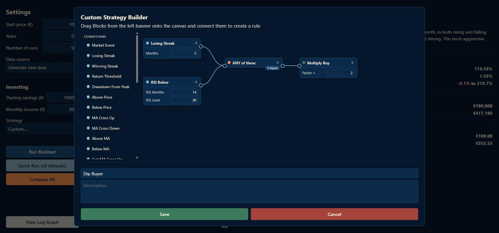
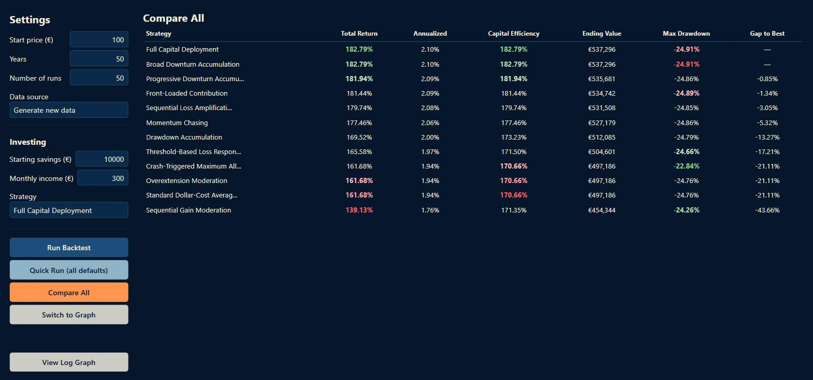

<div align="center">

# Indexing Strategy Simulator

No install, runs entirely in your browser.

[](#project-structure)
[](#getting-started)
[](https://github.com/RiccardoPerana/Indexing-Strategy-Simulator/actions/workflows/pages.yml)
[](LICENSE)

[Overview](#problem-statement-and-overview) ·
[Architecture](#technical-architecture-and-approach) ·
[Quick start](#quick-start-and-usage) ·
[Challenges](#challenges-and-engineering-solutions) ·
[Limitations](#limitations) ·
[Results](#results-and-performance-analysis) ·
[License](#license)

</div>

<div align="center">

[](https://riccardoperana.github.io/Indexing-Strategy-Simulator/)

</div>

<p align="center">
  
</p>

A backtesting tool for capital accumulation indexing strategies, such as
Dollar Cost Averaging. It runs entirely in your browser: define a
strategy as a set of rules ("buy more during a crash," "escalate
contributions the longer a downturn runs"), then test it against
randomly generated price histories to evaluate its effectiveness or
compare it against other strategies. Prices are randomly generated rather
than drawn from historical market data, a deliberate choice explained under
[Design philosophy](#design-philosophy).

## Problem statement and overview

### Design philosophy

Two decisions shape how results are generated and reported, and both
follow from the same underlying goal: a strategy's evaluation should
reflect how it behaves in general, not how it happened to perform on
one specific sequence of events.

#### Synthetic data, not historical backtesting

Prices are generated randomly rather than drawn from a real market's
history. Testing a strategy against one specific historical sequence
— the S&P 500's last 50 years, for example — invites the "past
performance is not indicative of future results" problem. A strategy
fit to perform well on one historical path would be considered a good
performer, even when it would not be advisable to use in any other market.
A rule such as "buy double after a 20% decline" will look excellent when
tested against a market that happened to recover from every one of its
declines; but that says nothing about how the rule would perform against
a market that does not recover in the same way.

The one assumption this project does rely on — that equities carry a
positive long-run return expectation, generally exceeding that of bonds
— is well-established enough to be built into the price model's drift
calibration (see [How prices are generated](#how-prices-are-generated)).
Everything else about a given run — the specific path, the timing of
downturns, volatility clustering — is left to chance by design, so a
strategy is evaluated against a genuine distribution of possible
markets rather than a single historical anecdote.

#### Median, not average

For a lognormal process such as GBM (and only approximately once jumps are
added, as in this simulator):

```text
mean(outcome) = median(outcome) × e^(½ · variance · time)
```

This follows directly from Jensen's inequality (the exponential function
is convex): that correction term is never negative, so average return
sits above median return structurally, not as an artifact of any
particular run, and increasingly so over longer horizons and higher
volatility. Losses are capped at −100% while gains are unbounded, which
pushes in the same direction independently.

Median return describes the outcome a single investor living through
one actual timeline should expect. Average return describes a
hypothetical pool of many parallel timelines averaged together, which no
individual investor can experience. This project reports median as the
primary statistic throughout, with average retained as a secondary
signal of how skewed a strategy's outcome distribution is.

One qualification: this relationship can invert once annualized. A
handful of near-total-loss runs annualize toward −100%, which can pull
*average annual* return *below* median (the reverse of what happens with
total, non-annualized return). Neither direction is assumed in advance —
each statistic is computed independently and reported on its own terms.

### Features

- **Rule-based strategy engine** — every strategy is defined as data,
  not custom code: a list of trigger → action rules. There are thirteen
  built-in strategies to cover common approaches: dollar-cost averaging,
  crash buying, momentum, drawdown-based accumulation, and others.
- **Visual logic-block strategy builder** — build your own strategy by
  dragging condition, logic-gate, and action blocks onto a canvas and
  wiring them together, rather than writing rules by hand. Conditions
  cover market events, losing/winning streaks, return thresholds,
  drawdown from peak, fixed price levels, moving-average crosses (simple
  and exponential), a fast/slow dual-MA cross, and RSI overbought/
  oversold — combinable with ALL / ANY / NOT logic gates.
- **Randomized price simulation** — Geometric Brownian Motion with jump
  diffusion is used for the creation of time series. Each backtest run
  samples its own market regime rather than assuming one fixed growth
  rate, so that results reflect a genuine range of possible outcomes.
  See [How prices are generated](#how-prices-are-generated).
- **Median-first statistics** — return, annualized return, and ending
  value are reported as medians rather than averages. See
  [Design philosophy](#design-philosophy) for why this matters.
- **Compare All** — runs every strategy against identical market data
  and ranks them side by side, with total return, annualized return,
  capital efficiency, ending value, maximum drawdown, and gap to the
  best performer for each.
- **Interactive chart** — click-drag to pan, scroll to zoom, toggle
  between linear and logarithmic price scales, with automatic
  highlighting of sustained multi-year rallies and declines.
- **Custom strategies** can be saved for the current session, so several
  variations can be built and compared without rebuilding them each
  time. Saved strategies join the dropdown and are included in
  **Compare All** alongside the built-in presets. A saved strategy whose
  name is already taken is numbered automatically (`Custom Strategy`,
  `Custom Strategy (2)`, …), so every dropdown entry stays distinct and
  selects the strategy it names.

## Technical architecture and approach

Built with plain HTML, CSS and JavaScript: no libraries and no build step,
with the chart drawn directly on a Canvas 2D context. The site is deployed to
GitHub Pages by a GitHub Actions workflow.

### How prices are generated

Prices are generated using **Geometric Brownian Motion with jump
diffusion** — a standard extension of plain GBM that adds sudden drops
and spikes on top of ordinary month-to-month variation:

- **Diffusion** — month-to-month variation drawn from a normal
  distribution.
- **Jumps** — two independent rare-event processes: occasional sharp
  **crash** jumps (large, negative) and occasional sharp **bubble**
  jumps (large, positive), asymmetric in both frequency and size
  (crashes more frequent and typically larger, consistent with observed
  market behavior).

No run uses a single fixed expected return. Each simulation run samples
its own annual drift and volatility once, at the start of that run, from
ranges defined in `js/price_generator.js`, so a backtest's results
reflect a genuine distribution of possible market conditions rather than
one scripted outcome. The jump asymmetry is compensated for
automatically: a run sampled at 0% drift averages to 0% in practice,
rather than being silently pulled down by the crash/bubble imbalance.

### Market events

Each month's return is classified into one of six named events, based
on the percentage change from the previous month. These categories are
what strategy triggers react to (see
[How the strategy engine works](#how-the-strategy-engine-works) below).

| Event | Monthly return |
|---|---|
| Crash | below −10% |
| Extreme Loss | −10% to −6% |
| Loss | −6% to 0% |
| Gain | 0% to 6% |
| Extreme Gain | 6% to 10% |
| Bubble | above 10% |

Gain and Loss are defined up to 6% rather than 5%, closing what would
otherwise be an undefined 5%–6% band and ensuring every possible return
maps to exactly one event with no gaps or overlaps — see
`js/market_events.js` for the classification logic and the reasoning
behind that specific boundary.

A return landing exactly **on** a threshold is assigned to the milder of
the two adjacent categories, symmetrically in magnitude: exactly −10% is
an Extreme Loss rather than a Crash, exactly +10% an Extreme Gain rather
than a Bubble; exactly −6% is a Loss rather than an Extreme Loss, and
exactly +6% a Gain rather than an Extreme Gain. The ranges in the table
above are therefore inclusive at the end farther from zero, and a return of
exactly 0% is a Gain.

### How the strategy engine works

Every strategy is data: a list of **rules**, where each rule pairs a
**trigger** (the condition under which it fires) with an **action**
(the resulting adjustment to that month's buy amount).

```js
new Rule(
  new Trigger({ type: "event", event: MarketEvent.CRASH }),
  new Action({ type: "set_fixed", value: Infinity })  // buy as much as possible
)
```

All matching rules apply, in order, each transforming the running buy
amount before the next rule sees it. A per-event multiplier and a
streak-escalation rule therefore compose rather than compete: a 1.5x
loss multiplier combined with a +1x/month streak escalation, on a
3-month streak, produces 1.5 × 3 = 4.5x the base amount. If no rule
matches, the base buy (the monthly contribution, unless overridden) is
used unchanged. The **Custom Strategy Builder** compiles the block graph
you draw directly into this same Rule/Trigger/Action structure.

**Trigger types:**
- `"event"` — fires on a specific [market event](#market-events)
- `"sequential_loss"` / `"sequential_gain"` — fires after N consecutive
  losing or gaining months
- `"return_threshold"` — fires when the return crosses a custom value,
  for thresholds that fall outside the six named events
- `"drawdown_from_peak"` — fires when price is a given fraction below
  the highest price reached so far in the simulation
- `"price_threshold"` — fires when price is above/below a fixed € level
- `"ma_cross"` / `"ema_cross"` — fires the month price crosses a moving
  average (simple or exponential)
- `"ma_state"` / `"ema_state"` — fires while price is currently above/
  below a moving average
- `"ma_dual_cross"` — fires when a fast SMA crosses a slow SMA (a
  classic golden-cross/death-cross)
- `"rsi_threshold"` — fires while Wilder's RSI is above/below a
  level
- `"logic"` — a compound trigger combining several child triggers with
  `mode: "all"` (AND), `"any"` (OR), or `"not"` (negates its one child)

Moving-average, RSI, and price-level triggers are all in **months**, not
trading days — this simulator has no daily resolution.

**Action types:**
- `"multiply"` — scales the base buy (2.0 = double, 0.5 = half)
- `"set_fixed"` — buys exactly this amount (`Infinity` = as much as
  available cash allows)
- `"add_fixed"` — adds a flat amount to the base buy
- `"skip"` — buys nothing this month
- `"scale_with_streak"` — escalates a multiplier the longer a streak
  runs, up to a cap

#### Adding a new strategy

No changes to the simulation engine are required. Add a factory function
to `js/presets.js` that returns a `Strategy` built from rules, and add it
to the `PRESETS` list.

### Project structure

| File | Responsibility |
|---|---|
| `index.html` | Page structure: settings/chart/output layout and the Custom Strategy Builder modal |
| `css/style.css` | The dark navy/cream page theme |
| `js/market_events.js` | Classifies a month's return into one of six named events |
| `js/price_generator.js` | Generates random monthly price histories (GBM + jump diffusion) |
| `js/indicators.js` | SMA/EMA/RSI computation for the block editor's indicator conditions |
| `js/strategy.js` | The rule engine: `Trigger` + `Action` + `Rule` + `Strategy` |
| `js/presets.js` | Built-in example strategies, built entirely from the rule engine |
| `js/simulator.js` | Runs one strategy against one price history, month by month |
| `js/backtest.js` | Runs N simulations, aggregates stats, and powers Compare All |
| `js/theme.js` | Colors set from script: the canvas chart and the Compare All rank highlights |
| `js/dashboard.js` | Stats formatting and sustained-trend detection for the chart |
| `js/chart.js` | Canvas 2D chart rendering, pan/zoom, and hover tooltip |
| `js/block_editor.js` | The drag-and-drop logic-block Custom Strategy Builder |
| `js/app.js` | UI wiring — the main entry point |

## Quick start and usage

### Getting started

No installation, no build step, no dependencies — this is a static
HTML/CSS/JS app that runs entirely client-side.

**Use it right now:** [riccardoperana.github.io/Indexing-Strategy-Simulator](https://riccardoperana.github.io/Indexing-Strategy-Simulator/) — hosted for free on GitHub Pages, deployed automatically from `main` via `.github/workflows/pages.yml`.

**Run it locally:** open `index.html` directly in a browser (double-click
it, or `start index.html` / `open index.html`), or serve the folder with
anything static, e.g. `python -m http.server`.

### Usage

Settings on the left, chart in the middle, results on the right.

1. Set the market parameters (starting price, years, number of
   simulation runs) and your investing parameters (starting capital,
   monthly contribution).
2. Choose a **Data source**. *Generate new data* draws a fresh set of
   random price histories. *Reuse previous run's data* re-tests against
   the exact price histories the last run used, so two strategies can be
   compared on identical markets — see
   [Reusing price data](#reusing-price-data) below.
3. Pick a strategy from the dropdown, or choose **Custom...** to build
   your own with the logic-block builder.
4. **Run Backtest** to simulate your current settings, or **Quick Run**
   to run the first preset with all defaults instantly.
5. **Compare All** runs every strategy — presets plus any custom
   strategies you've built or saved this session — against identical
   price data (the previous run's, when *Reuse previous run's data* is
   selected) and ranks them in a table. Toggle between the table and
   the underlying market chart with the button that appears below
   **Compare All**.
6. Toggle the chart between linear and logarithmic price scale with the
   button at the very bottom of the settings panel.

#### Reusing price data

Starting price, years, and number of runs are properties of the price
*series*, fixed when it was generated. Selecting **Reuse previous run's
data** therefore locks those three fields: they snap to the stored
series' actual values and become read-only until *Generate new data* is
selected again (at which point whatever you had typed before is
restored).

Starting savings, monthly contribution, and the chosen strategy stay
editable throughout — those are applied by the simulator rather than the
price generator, and varying them against fixed price data is the point
of the feature.

## Challenges and engineering solutions

Running thousands of simulated markets in a browser, and letting users wire
strategies together freely, surfaced several problems that are not visible
from the interface. The more significant ones, and how each was addressed:

- **Recomputing indicators every month.** A moving-average or RSI condition
  is evaluated once per month of every run, and recomputing its series from
  the full price history each time makes a run's cost grow with the square
  of its length — for every indicator, across thousands of runs. Each series
  is instead computed once and cached in a `WeakMap` keyed on the price array
  itself, together with the indicator and its period. A price array never
  changes once generated, so a cached series stays valid for as long as the
  array lives, including when *Reuse previous run's data* runs it again, and
  is released with it.

- **State leaking between runs.** A strategy is defined once and run against
  thousands of markets, but one kind of rule carries state: the "start high,
  then drop to income level" base buy has its fallback amount patched to
  each run's real monthly contribution. Sharing one strategy object across
  runs would carry that patch from one market into the next. Every backtest
  run works on its own copy of the strategy instead; triggers and actions are
  stateless, so a shallow copy of each is enough.

- **Block graphs the engine cannot run.** The Custom Strategy Builder lets
  blocks be wired freely, which admits graphs with no meaning as a strategy:
  a loop of logic gates, or parameters the engine cannot use — a 0-month
  streak matches every month, and a zero, negative or fractional indicator
  period turns every indicator value into NaN. The builder refuses any
  connection that would close a loop, rounds and clamps numeric parameters
  to their valid range as they are entered, and compiles a condition that
  feeds several gates once per gate, so each branch keeps every condition
  wired into it.

- **A chart that resized itself.** A canvas sized to fill its container can
  push that container larger, which resizes the canvas again, in a feedback
  loop. The canvas sits in an absolutely positioned stage taken out of
  normal flow, so the container's size is decided by the page layout alone.
  Hidden charts, which measure 0×0 while Compare mode is showing, are
  skipped until they become visible, and the window-level drag listeners
  are removed when a chart is torn down, so re-rendered charts do not
  accumulate stale listeners that keep old charts alive in memory.

## Limitations

- **Selling is not implemented.** The project is scoped around wealth
  *accumulation* strategies specifically, rather than trade timing in the
  buy/sell sense. A meaningful part of what a moving-average-triggered
  approach would add is already covered by the moving-average, RSI, and
  drawdown-from-peak conditions in the rule engine, so a literal sell
  action was judged a larger scope expansion than a genuinely new
  analytical capability.
- **No volume-based conditions.** The price generator only ever
  simulates price, never trading volume, so indicators like a volume
  spike or dry-up have no data to compute from.
- **No fees or expense ratios.** Real index funds carry costs that
  compound meaningfully over a 50-year horizon. Omitted deliberately in
  this version: the settings screen already asks for several inputs, and
  each additional parameter reduces how approachable the tool is.
- **No historical backtesting.** Prices are synthetic by design; see
  [Design philosophy](#design-philosophy) for the full reasoning.
- **Saved custom strategies are session-only**, kept in memory and
  cleared on page reload. This was simpler than adding persistence for a
  feature capped at 10 entries.

## Results and performance analysis

### Findings

What the simulator shows once every built-in strategy is run many times.
The chart below compares the two standout strategies with the Standard
Dollar-Cost Averaging baseline, across 5,000 shared 50-year markets with
the default settings (€10,000 starting savings, €300/month). Run
**Compare All** in the app to see every preset. Rerunning gives slightly
different figures but the same pattern.

<p align="center">
  
</p>

**1. Getting money into the market early beats timing it.** The highest
median belongs to Full Capital Deployment, tied with Broad Downturn
Accumulation (which goes all-in after its first down month, so the two
end up nearly identical). This held at 20, 30 and 50 years and with
€10k or €100k starting savings. Every other buying rule beats Full
Capital Deployment in only about 20–35% of individual markets. Most
"smart" rules are really rules for *holding cash longer*, and cash earns
nothing while the market drifts upward.

**2. Reacting to last month's move doesn't help, by construction.** The
price model draws each month's return independently, so a crash, a
losing streak or a bubble month says nothing about what happens next.
Crash-buying, momentum, and streak rules can only change *when* cash goes
in, not the odds of the next month. This mirrors the real-world finding
that short-term returns are close to unpredictable.

**3. The one signal with real information is the long-run trend.** Each
run has its own hidden growth rate, and a very long moving average
slowly reveals it. Trend-Guarded Deployment (all-in, but pause buying
while the index is below its 10-year average) gives up roughly 1% of
median wealth and in return lifts the worst-5% outcome by about 50%. It
is insurance against the rare market that never recovers, not a way to
earn more on average.

**4. Some headline metrics can be gamed.** Capital Efficiency only counts
money that was actually invested, so a strategy that buys only in rare
crash months can score well on it while leaving most of its savings idle.
Compare strategies on Total Return (which counts idle cash) first.

**The caveat.** These are properties of the price model: independent
monthly returns, a positive average drift, and no fees or taxes. Real
markets show some short-term momentum and long-term mean reversion,
which this model deliberately leaves out. The findings are strongest as a
statement about what timing rules *cannot* do without such patterns.

### Screenshots

#### Custom Strategy Builder

<p align="center">
  
</p>

#### Compare All

<p align="center">
  
</p>

## License

MIT — see [LICENSE](LICENSE).
