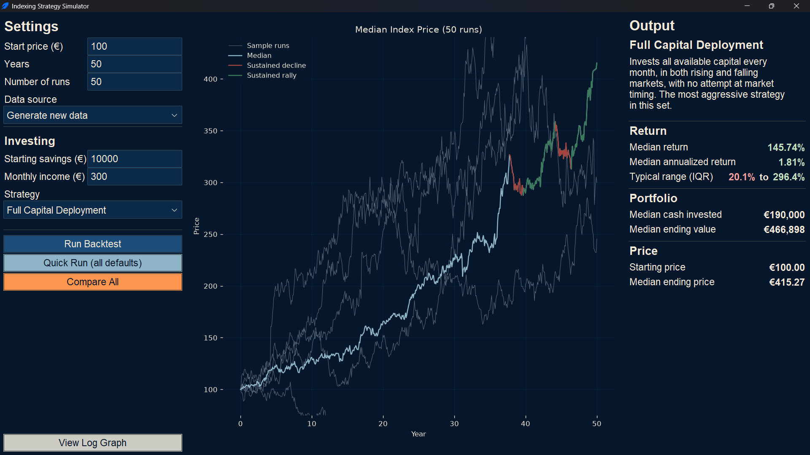
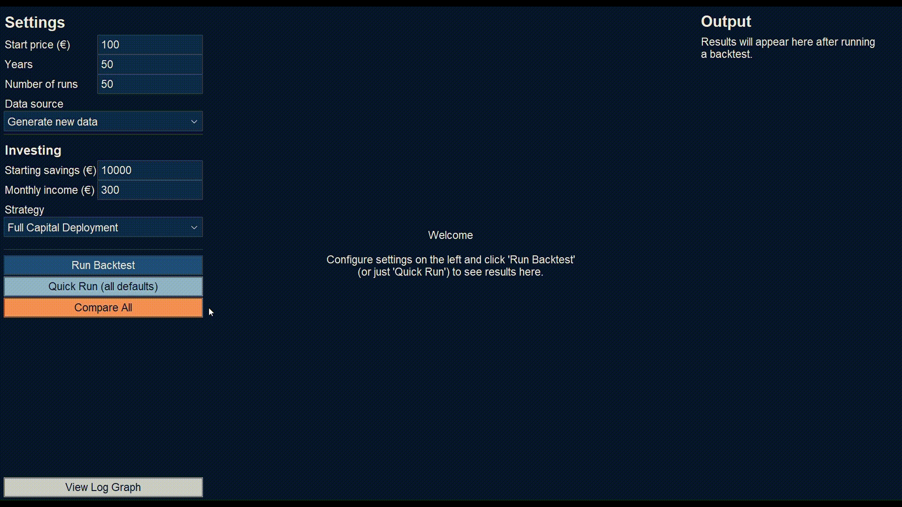
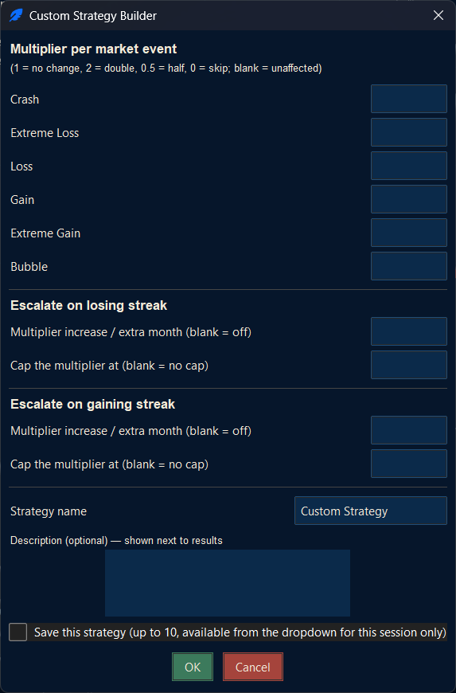
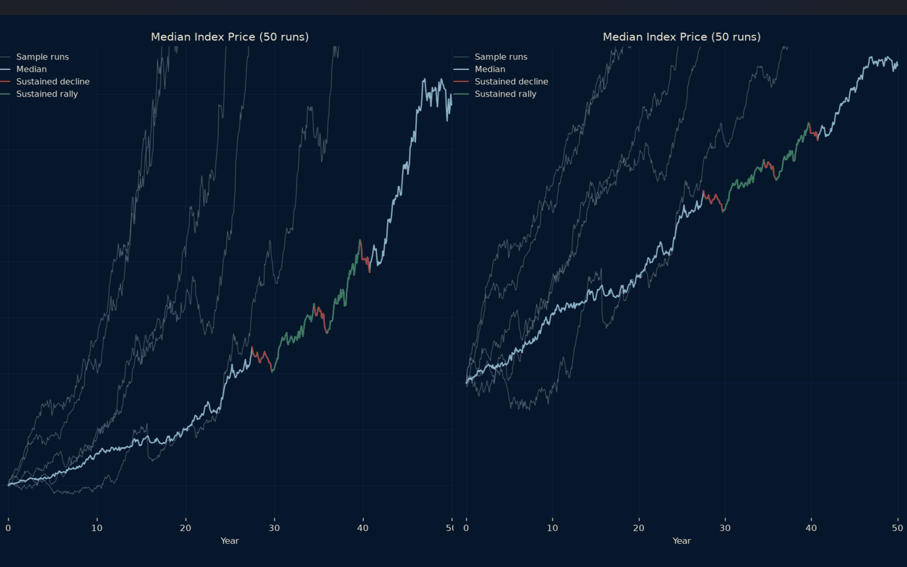

# Indexing Strategy Simulator




A backtesting tool for capital accumulation indexing strategies,
such as Dollar Cost Averaging. This tool allows to define a strategy 
as a set of rules ("buy more during a crash," "escalate contributions 
the longer a downturn runs"), and to test it against randomly generated 
price histories, to evaluate its effectiveness or compare it against 
other strategies.

Prices are randomly generated rather than drawn from historical market
data as a deliberate choice. See [Design philosophy](#design-philosophy) 
for the reasoning.

## Features

- **Rule-based strategy engine** — every strategy is defined as data, 
  not custom code: a list of trigger → action rules. There are twelve 
  built-in strategies to cover common approaches: dollar-cost averaging,
  crash buying, momentum, drawdown-based accumulation, and others, and 
  the program features a builder to support the creation of custom strategies.
- **Randomized price simulation** — Geometric Brownian Motion with jump
  diffusion is used for the creation of time series. Each backtest run 
  samples its own market regime rather than assuming one fixed growth rate, 
  so that results reflect a genuine range of possible outcomes. 
  See [How prices are generated](#how-prices-are-generated).
- **Median-first statistics** — return, annualized return, and ending
  value are reported as medians rather than averages. See
  [Design philosophy](#design-philosophy) for why this matters.
- **Compare All** — runs every strategy against identical market data
  and ranks them side by side, with total return, annualized return,
  capital efficiency, ending value, maximum drawdown, and gap to the
  best performer for each.
- **Interactive chart** — click-drag to pan, scroll to zoom, toggle
  between linear and logarithmic price scales, with automatic
  highlighting of sustained multi-year rallies and declines.
- **Custom strategies** can be saved for the current session, so several
  variations can be built and compared without re-entering rules each
  time.

## Screenshots

### Compare All


### Custom Strategy Builder


### Linear vs. logarithmic scale


## Installation

### Run from source

Requires Python 3.9+.
Compatible with all major operating systems.

```bash
pip install -r requirements.txt
python gui_tk.py
```

### Standalone Windows executable

This is the easiest option for installation:
**[download the latest build from Releases](../../releases/latest)**
— no Python installation needed at all.

To build one yourself instead:

```bash
build_exe.bat
```

Or double click the .bat file.
This runs on Windows only (see [Building a standalone executable](#building-a-standalone-executable)
below for details and why).
This will create a /build folder, inside of which will sit an 
standalone executable containing the program.

## Usage

Settings on the left, chart in the middle, results on the right.

1. Set the market parameters (starting price, years, number of
   simulation runs) and your investing parameters (starting capital,
   monthly contribution).
2. Pick a strategy from the dropdown, or choose **Custom...** to build
   your own from triggers and actions.
3. **Run Backtest** to simulate your current settings, or **Quick Run**
   to run preset #1 with all defaults instantly.
4. **Compare All** runs every strategy — presets plus any custom
   strategies you've built this session — against identical price data
   and ranks them in a table. Toggle between the table and the
   underlying market chart with the button that appears at the bottom
   of the settings panel.
5. Toggle the chart between linear and logarithmic price scale with the
   button at the very bottom of the settings panel.

## Design philosophy

Two decisions shape how results are generated and reported, and both
follow from the same underlying goal: a strategy's evaluation should
reflect how it behaves in general, not how it happened to perform on
one specific sequence of events.

### Synthetic data, not historical backtesting

Prices are generated randomly rather than drawn from a real market's
history. Testing a strategy against one specific historical sequence
— the S&P 500's last 50 years, for example — invites the "past
performance is not indicative of future results" problem. A strategy 
fit to perform well on one historical path would be considered a good 
performer, even when it would not be advisable to use in any other market.
A rule such as "buy double after a 20% decline" will look excellent when
tested against a market that happened to recover from every one of its 
declines; but that says nothing about how the rule would perform against
a market that does not recover in the same way.

The one assumption this project does rely on — that equities carry a
positive long-run return expectation, generally exceeding that of bonds
— is well-established enough to be built into the price model's drift
calibration (see [How prices are generated](#how-prices-are-generated)).
Everything else about a given run — the specific path, the timing of
downturns, volatility clustering — is left to chance by design, so a
strategy is evaluated against a genuine distribution of possible
markets rather than a single historical anecdote. Sourcing clean,
correctly licensed historical data was also a substantial undertaking in
its own right, and secondary to the reasoning above.

### Median, not average

For any compounding growth process:

```
mean(outcome) = median(outcome) × e^(½ · variance · time)
```

This follows directly from Jensen's inequality (the exponential function
is convex): that correction term is never negative, so average return
sits above median return structurally, not as an artifact of any
particular run, and increasingly so over longer horizons and higher
volatility. Losses are capped at −100% while gains are unbounded, which
pushes in the same direction independently.

Median return describes the outcome a single investor living through
one actual timeline should expect. Average return describes a
hypothetical pool of many parallel timelines averaged together, which no
individual investor can experience. This project reports median as the
primary statistic throughout, with average retained as a secondary
signal of how skewed a strategy's outcome distribution is.

One qualification: this relationship can invert once annualized. A
handful of near-total-loss runs annualize toward −100%, which can pull
*average annual* return *below* median (the reverse of what happens with
total, non-annualized return). Neither direction is assumed in advance —
each statistic is computed independently and reported on its own terms.

## How prices are generated

Prices are generated using **Geometric Brownian Motion with jump
diffusion** — a standard extension of plain GBM that adds sudden drops
and spikes on top of ordinary month-to-month variation:

- **Diffusion** — month-to-month variation drawn from a normal
  distribution.
- **Jumps** — two independent rare-event processes: occasional sharp
  **crash** jumps (large, negative) and occasional sharp **bubble**
  jumps (large, positive), asymmetric in both frequency and size
  (crashes more frequent and typically larger, consistent with observed
  market behavior).

No run uses a single fixed expected return. Each simulation run samples
its own annual drift and volatility once, at the start of that run, from
ranges defined in `price_generator.py`, so a backtest's results reflect
a genuine distribution of possible market conditions rather than one
scripted outcome. The jump asymmetry is compensated for automatically:
a run sampled at 0% drift averages to 0% in practice, rather than being
silently pulled down by the crash/bubble imbalance.

## Market events

Each month's return is classified into one of six named events, based
on the percentage change from the previous month. These categories are
what strategy triggers react to (see
[How the strategy engine works](#how-the-strategy-engine-works) below).

| Event | Monthly return |
|---|---|
| Crash | below −10% |
| Extreme Loss | −10% to −6% |
| Loss | −6% to 0% |
| Gain | 0% to 6% |
| Extreme Gain | 6% to 10% |
| Bubble | above 10% |

Gain and Loss are defined up to 6% rather than 5%, closing what would
otherwise be an undefined 5%–6% band and ensuring every possible return
maps to exactly one event with no gaps or overlaps — see
`market_events.py` for the classification logic and the reasoning
behind that specific boundary.

## How the strategy engine works

Every strategy is data: a list of **rules**, where each rule pairs a
**trigger** (the condition under which it fires) with an **action**
(the resulting adjustment to that month's buy amount).

```python
Rule(
    trigger=Trigger(type="event", event=MarketEvent.CRASH),
    action=Action(type="set_fixed", value=float("inf")),  # buy as much as possible
)
```

All matching rules apply, in order, each transforming the running buy
amount before the next rule sees it. A per-event multiplier and a
streak-escalation rule therefore compose rather than compete: a 1.5x
loss multiplier combined with a +1x/month streak escalation, on a
3-month streak, produces 1.5 × 3 = 4.5x the base amount. If no rule
matches, the base buy (the monthly contribution, unless overridden) is
used unchanged.

**Trigger types:**
- `"event"` — fires on a specific [market event](#market-events)
- `"sequential_loss"` / `"sequential_gain"` — fires after N consecutive
  losing or gaining months
- `"return_threshold"` — fires when the return crosses a custom value,
  for thresholds that fall outside the six named events
- `"drawdown_from_peak"` — fires when price is a given fraction below
  the highest price reached so far in the simulation

**Action types:**
- `"multiply"` — scales the base buy (2.0 = double, 0.5 = half)
- `"set_fixed"` — buys exactly this amount (`float('inf')` = as much as
  available cash allows)
- `"add_fixed"` — adds a flat amount to the base buy
- `"skip"` — buys nothing this month
- `"scale_with_streak"` — escalates a multiplier the longer a streak
  runs, up to a cap

### Adding a new strategy

No changes to the simulation engine are required. Add a factory function
to `presets.py` that returns a `Strategy` built from rules, and register
it in `ALL_PRESETS`.

## Project structure

| File | Responsibility |
|---|---|
| `market_events.py` | Classifies a month's return into one of six named events (Crash / Extreme Loss / Loss / Gain / Extreme Gain / Bubble) |
| `price_generator.py` | Generates random monthly price histories (GBM + jump diffusion) |
| `strategy.py` | The rule engine: `Trigger` + `Action` + `Rule` + `Strategy` |
| `presets.py` | Built-in example strategies, built entirely from the rule engine |
| `simulator.py` | Runs one strategy against one price history, month by month |
| `backtest.py` | Runs N simulations, aggregates stats, and powers Compare All |
| `saved_strategies.py` | Session-only persistence for custom strategies built via the GUI |
| `dashboard.py` | Chart-drawing and stats formatting used by the GUI |
| `interactive_chart.py` | Click-drag pan / scroll-wheel zoom for the chart |
| `gui_theme.py` | Color palette and ttkbootstrap theme registration for the GUI |
| `gui_tk.py` | The desktop GUI (Tkinter + ttk, themed with ttkbootstrap) — main entry point |

## Building a standalone executable

`build_exe.bat` uses [PyInstaller](https://pyinstaller.org/) to bundle
the GUI and all its dependencies into a single `IndexingStrategySimulator.exe`
that runs on any Windows machine with no Python installation required.

This has to be run **on Windows** — PyInstaller builds an executable for
whatever operating system it runs on; it can't cross-compile a Windows
`.exe` from Linux or macOS. If you're distributing to Mac or Linux users,
run the same script (renamed `build_exe.sh` with the equivalent
`pyinstaller` command) on that platform instead.

## Known scope decisions

- **Selling is not implemented.** The project is scoped around wealth
  *accumulation* strategies specifically, rather than trade timing in the
  buy/sell sense. A meaningful part of what a moving-average-triggered
  approach would add is already covered by the drawdown-from-peak and
  streak-based triggers already in the rule engine (buying more after
  sustained declines or gains), so a literal sell action was judged a
  larger scope expansion than a genuinely new analytical capability.
  `Strategy.allow_selling` remains reserved for this.
- **No fees or expense ratios.** Real index funds carry costs that
  compound meaningfully over a 50-year horizon. Omitted deliberately in
  this version: the settings screen already asks for several inputs, and
  each additional parameter reduces how approachable the tool is. A
  reasonable candidate for a future version, but not a prerequisite for
  the core mechanics.
- **No historical backtesting.** Prices are synthetic by design; see
  [Design philosophy](#design-philosophy) for the full reasoning.
- **Saved custom strategies are session-only**, deleted when the GUI
  closes. This was simpler than building a management/delete interface
  for a feature capped at 10 entries.

## License

[MIT](LICENSE) — see the `LICENSE` file. Update the copyright holder name
in that file before publishing if you'd like your name on it specifically
rather than the generic placeholder.
